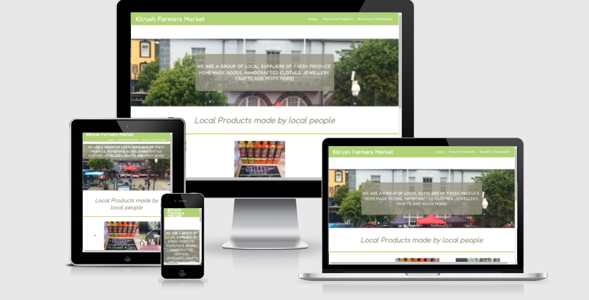
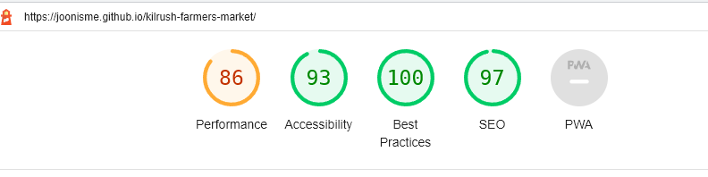
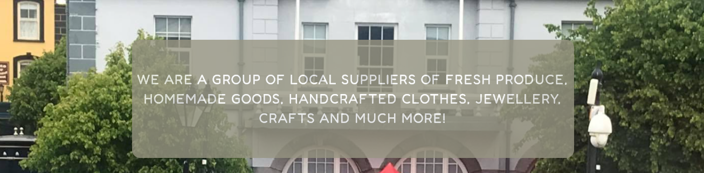
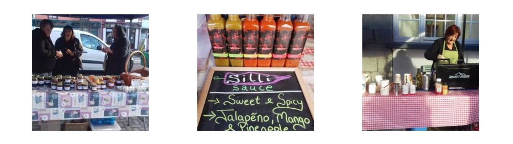
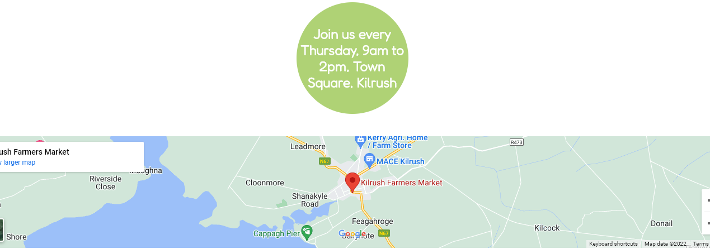
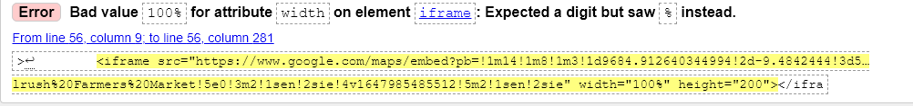

# Kilrush Farmers Market

Kilrush Farmers Market is a site that advertises the Kilrush Farmers Market to attract customers by showcasing the products available, the times and location of the market and also access to their social media links. It also aims to entice stallholders through it's online form. The website is responsive across both large and small screens. 

The website can be viewed at https://joonisme.github.io/kilrush-farmers-market/

The lighthouse report shows the following results:

## Features

The navigation bar is on all three pages, by clicking on the Kilrush Farmers Market logo it will bring you back to the homepage. Each page is title includes the name of the page the user is on for ease of navigation should the user have several browser tabs open. 

The landing page background image shows a distant image of the market to give the user a visual idea of what the market looks like and where it is. The text overlay gives a brief description of what the purpose of the Farmers Market is. 

This section gives the user a high level idea of some of the products the farmers market sells to entice the user to come to the market. 

Next we have the time and day of when the Farmers Market is on. The map above the footer gives the exact location of the market. The flow of the section, from the images, down to the times and then the map is designed to attract the user to the market. 

The Footer section provies links to social media to invite the users to access more up to date information on the market. 

## Featured Products

The Featured Products page highlights products available at the market with a description of the products and giving names to the stallholders to give it a local community feel. There is an opportunity for further development to include all stallholders and their products. 

## Become a Stallholder

This page is for members of the public who wish to sell at the market. The form allows them to add their name, phone number, email address. The text area includes a placeholder asking the user to give a descripton of what they would like to sell. 

## Possible Additional Features

The Featured Products page was designed to give an idea of what could be included in here, there is an opporutnity to include more products and stallholders. Visually it might be better to reformat the text so that it is inline with the images in order to give more space and provide a better user experience. 

## Testing

Testing was carried out on the following browsers - Google Chrome, Firefox and Microsoft Edge. 

### Validator Testing

#### HTML
One error was found when testing, in relation to the width of the map.

After learning how to add a map through the Coders Coffeehouse project, I decided to leave the width as it was. 

#### CSS
One error was found when passing through the official (Jigsaw) validator. This is a parse error on line 341 which I was unable to delete. 

## Deployment

This project was depolyed through github pages, the steps are as follows:

In the GitHub repository, navigate to the Settings tab, then choose Pages from the left hand menu 
From the source section drop-down menu, select the Main Branch
Once the master branch has been selected, the page will be automatically refreshed with a detailed ribbon display to indicate the successful deployment
Any changes pushed to the master branch will take effect on the live project

The live project can be found at https://joonisme.github.io/kilrush-farmers-market/

## Credits

The form styling was taken from https://codepen.io/ZachSaucier/pen/jOwNvO and styling edited to compliment the sites UI.
The map dimensions were taken from Coders Coffeehouse and adjusted slightly.

## Media
The photos used on the site are taken from the Kilrush Farmers Market facebook page with permission from the Chairperson.

